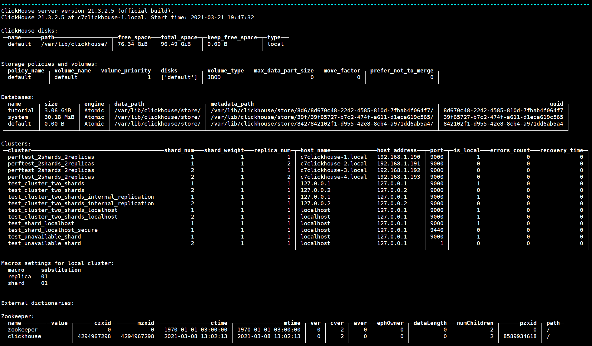

## ch_dba_scripts - ClickHouse DBA scripts

A collection of shell scripts for ClickHouse database administrator (DBA). Tested on ClickHouse version 21.3.2.5-lts.

#### [scripts/clickhouse_activity.sh](#clickhouse_activity). ClickHouse monitoring script, all information is displayed on one page. 

General information:
- Displays ClickHouse version, hostname and IP address, CPU and Disks load;
- Apache ZooKeeper cluster status;
- ClickHouse disks;
- Databases information;
- Cluster information and status.

Replication:
- Replicated tables located on the local server;
- Replication queue;
- Replicated fetches;
- Distribution queue;
- Merges and part mutations currently in process for tables in the MergeTree family;
- Mutations of MergeTree tables and their progress.

Activity:
- Queries that is being processed;
- At the end, the last entries of the ClickHouse log file are displayed.

[scripts/clickhouse_activity_refresh.sh](#clickhouse_activity). Fast refresh of the **clickhouse_activity.sh** script every 5 seconds.


#### [scripts/clickhouse_information.sh](#clickhouse_information). ClickHouse information script, a single tape with details about ClickHouse work.

General information:
- ClickHouse version;
- ClickHouse disks;
- Storage policies and volumes;
- Databases information;
- Cluster information;
- Macros settings for local cluster;
- External dictionaries;
- Zookeeper cluster information.

Settings:
- Settings that have been changed from its default values;
- Settings profiles. Properties of configured setting profiles;
- Settings profile elements. Content of the settings profile;
- Error codes with the number of times they have been triggered

Users, roles, profiles, quotas, grants:
- Users;
- Grants;
- Roles;
- Role grants;
- Settings profiles;
- Row policies for the specified table;
- Quotas;
- Quota consumption for all users;
- Quota limits. Information about maximums for all intervals of all quotas.

Tables:
- Tables compress ratio;
- Top tables by size;
- Top tables MergeTree families by size;
- Tables in memory (Memory engine);
- Detached parts of MergeTree tables.

Replication:
- Replicated tables located on the local server;
- Replication queue;
- Replicated fetches;
- Distribution queue;
- Merges and part mutations currently in process for tables in the MergeTree family;
- Mutations of MergeTree tables and their progress.

Queries:
- Longest running queries.

System activity:
- last 14 days;
- today by hours;
- today by minute.

Activity:
- Queries that is being processed. Ordered by elapsed time;
- Queries that is being processed. Ordered by memory usage.


#### Small scripts to manage ClickHouse:
- [scripts/clickhouse_start.sh](#clickhouse_start). Start ClickHouse systemctl service, confirmation is required.
- [scripts/clickhouse_stop.sh](#clickhouse_stop). Stop ClickHouse systemctl service, confirmation is required.
- [scripts/clickhouse_status.sh](#clickhouse_status). ClickHouse status. Additionally, ClickHouse processes and network connection are displayed.
- [scripts/clickhouse_logs.sh](#clickhouse_logs). Shows the ClickHouse log file with auto-update.

- [scripts/zookeeper_start.sh](#zookeeper_start). Start Apache ZooKeeper systemctl service, confirmation is required.
- [scripts/zookeeper_stop.sh](#zookeeper_stop). Stop Apache ZooKeeper systemctl service, confirmation is required.
- [scripts/zookeeper_status.sh](#zookeeper_status). Apache ZooKeeper status. Additionally, ZooKeeper processes, network connection and cluster status are displayed.
- [scripts/zookeeper_logs.sh](#zookeeper_logs). Shows the Apache ZooKeeper log file with auto-update.


## Installation

As user **root**, download the latest version of the scripts collection (see [Releases](https://github.com/Azmodey/ch_dba_scripts/releases) page):
```
# wget https://github.com/Azmodey/ch_dba_scripts/archive/1.0.0.tar.gz
```

Extract script files to separate directory (for example **~scripts/**) and grant the necessary execution rights:
```
# tar xvzf 1.0.0.tar.gz
# mv ch_dba_scripts-1.0.0/scripts ~/scripts
# chmod 700 ~/scripts/*.sh
```


## Setup

If you plan to use Apache ZooKeeper cluster health monitoring, you should add this feature to the configuration file.
Add the following lines to your ZooKeeper config file like **/opt/zookeeper/conf/zoo.cfg** :
```
# Whitelist for statistics
4lw.commands.whitelist=stat, mntr
```


---
### clickhouse_activity

ClickHouse monitoring script, all information is displayed on one page. 

General information:
- Displays ClickHouse version, hostname and IP address, CPU and Disks load;
- Apache ZooKeeper cluster status;
- ClickHouse disks;
- Databases information;
- Cluster information and status.

Replication:
- Replicated tables located on the local server;
- Replication queue;
- Replicated fetches;
- Distribution queue;
- Merges and part mutations currently in process for tables in the MergeTree family;
- Mutations of MergeTree tables and their progress.

Activity:
- Queries that is being processed;
- At the end, the last entries of the ClickHouse log file are displayed.

#### Setup:

Change the value of the LOG_LINES parameter in the script, which is responsible for displaying the number of last lines of the ClickHouse log file.
```
LOG_LINES=0		# Number of ClickHouse log lines to display. 0 - disable output
```

Change the value of the ZooKeeperHosts parameter in the script, which is responsible for displaying Apache ZooKeeper cluster status.
```
# Apache ZooKeeper hosts
ZooKeeperHosts=""						# "" - disable output
#ZooKeeperHosts="zoo_server_1 zoo_server_2 zoo_server_3"	# Servers list, hostnames. Format: "server_1" "server_2" ... 
```

#### Examples of work:

Inserting data into tutorial.hits_v1 table with MergeTree engine. In active **Queries**, the INSERT operation is observed, the progress of the **Merge** operation is visible for tables of the MergeTree family.


Inserting data into the tutorial.hits_replica table with the ReplicatedMergeTree engine. In active **Queries**, the INSERT operation is observed, the progress of the **Merge** operation for tables of the MergeTree family is visible, and in the **Replication queue** data is transferred to remote servers for tables of the ReplicatedMergeTree family.


---
### clickhouse_information

ClickHouse information script, a single tape with details about ClickHouse work.
General information:
- ClickHouse version;
- ClickHouse disks;
- Storage policies and volumes;
- Databases information;
- Cluster information;
- Macros settings for local cluster;
- External dictionaries;
- Zookeeper cluster information.

Settings:
- Settings that have been changed from its default values;
- Settings profiles. Properties of configured setting profiles;
- Settings profile elements. Content of the settings profile;
- Error codes with the number of times they have been triggered

Users, roles, profiles, quotas, grants:
- Users;
- Grants;
- Roles;
- Role grants;
- Settings profiles;
- Row policies for the specified table;
- Quotas;
- Quota consumption for all users;
- Quota limits. Information about maximums for all intervals of all quotas.

Tables:
- Tables compress ratio;
- Top tables by size;
- Top tables MergeTree families by size;
- Tables in memory (Memory engine);
- Detached parts of MergeTree tables.

Replication:
- Replicated tables located on the local server;
- Replication queue;
- Replicated fetches;
- Distribution queue;
- Merges and part mutations currently in process for tables in the MergeTree family;
- Mutations of MergeTree tables and their progress.

Queries:
- Longest running queries.

System activity (from system.metric_log table):
- last 14 days;
- today by hours;
- today by minute.

Activity:
- Queries that is being processed. Ordered by elapsed time;
- Queries that is being processed. Ordered by memory usage.

#### Examples of work:

General information.




Tables.


System activity history and Queries that is being processed.


---
### clickhouse_start

Start ClickHouse systemctl service, confirmation is required.

```
Start ClickHouse (Y/N)? y

ClickHouse status:
? clickhouse-server.service - ClickHouse Server (analytic DBMS for big data)
   Loaded: loaded (/etc/systemd/system/clickhouse-server.service; enabled; vendor preset: disabled)
   Active: active (running) since Thu 2021-03-18 13:07:45 MSK; 9ms ago
 Main PID: 8309 (clickhouse-serv)
   CGroup: /system.slice/clickhouse-server.service
           L-8309 /usr/bin/clickhouse-server --config=/etc/clickhouse-server/config.xml --pid-file=/run/clickhouse-server/clickhouse-server.pid

Mar 18 13:07:45 c7clickhouse-1.local systemd[1]: Started ClickHouse Server (analytic DBMS for big data).
```

---
### clickhouse_stop

Stop ClickHouse systemctl service, confirmation is required.

```
Stop ClickHouse (Y/N)? y

ClickHouse status:
? clickhouse-server.service - ClickHouse Server (analytic DBMS for big data)
   Loaded: loaded (/etc/systemd/system/clickhouse-server.service; enabled; vendor preset: disabled)
   Active: inactive (dead) since Thu 2021-03-18 13:07:24 MSK; 5ms ago
  Process: 6605 ExecStart=/usr/bin/clickhouse-server --config=/etc/clickhouse-server/config.xml --pid-file=/run/clickhouse-server/clickhouse-server.pid (code=exited, status=0/SUCCESS)
 Main PID: 6605 (code=exited, status=0/SUCCESS)

Mar 18 12:57:57 c7clickhouse-1.local clickhouse-server[6605]: Merging configuration file '/etc/clickhouse-server/config.d/connections.xml'.
Mar 18 12:57:57 c7clickhouse-1.local clickhouse-server[6605]: Merging configuration file '/etc/clickhouse-server/config.d/logger.xml'.
Mar 18 12:57:57 c7clickhouse-1.local clickhouse-server[6605]: Merging configuration file '/etc/clickhouse-server/config.d/macros_shard_and_replica_names.xml'.
Mar 18 12:57:57 c7clickhouse-1.local clickhouse-server[6605]: Merging configuration file '/etc/clickhouse-server/config.d/remote_servers_perftest_2shards_2replicas.xml'.
Mar 18 12:57:57 c7clickhouse-1.local clickhouse-server[6605]: Merging configuration file '/etc/clickhouse-server/config.d/settings_misc.xml'.
Mar 18 12:57:57 c7clickhouse-1.local clickhouse-server[6605]: Merging configuration file '/etc/clickhouse-server/config.d/zookeeper.xml'.
Mar 18 12:57:57 c7clickhouse-1.local clickhouse-server[6605]: Logging information to /var/log/clickhouse-server/clickhouse-server.log
Mar 18 12:57:57 c7clickhouse-1.local clickhouse-server[6605]: Logging errors to /var/log/clickhouse-server/clickhouse-server.err.log
Mar 18 13:07:22 c7clickhouse-1.local systemd[1]: Stopping ClickHouse Server (analytic DBMS for big data)...
Mar 18 13:07:24 c7clickhouse-1.local systemd[1]: Stopped ClickHouse Server (analytic DBMS for big data).
```


---
### clickhouse_status

ClickHouse status. Additionally, ClickHouse processes and network connection are displayed.

```
ClickHouse processes:
UID         PID   PPID  C STIME TTY          TIME CMD
root       6471   1671  0 12:55 pts/1    00:00:00 /bin/bash ./clickhouse_status.sh
clickho+   1379      1  0 11:39 ?        00:00:00 clickhouse-watchdog        --config=/etc/clickhouse-server/config.xml --pid-file=/run/clickhouse-server/clickhouse-server.pid
clickho+   1380   1379  1 11:39 ?        00:01:12  \_ /usr/bin/clickhouse-server --config=/etc/clickhouse-server/config.xml --pid-file=/run/clickhouse-server/clickhouse-server.pid

ClickHouse version:
ClickHouse server version 21.3.2.5 (official build).

ClickHouse network connection:
8123 - HTTP Client, 9000 - TCP/IP Native Client, 9004 - communicating using MySQL protocol, 9009 - Inter-Server Replication
tcp        0      0 0.0.0.0:8123            0.0.0.0:*               LISTEN      1380/clickhouse-ser 
tcp        0      0 0.0.0.0:9000            0.0.0.0:*               LISTEN      1380/clickhouse-ser 
tcp        0      0 0.0.0.0:9004            0.0.0.0:*               LISTEN      1380/clickhouse-ser 
tcp        0      0 0.0.0.0:9009            0.0.0.0:*               LISTEN      1380/clickhouse-ser 

ClickHouse status:
? clickhouse-server.service - ClickHouse Server (analytic DBMS for big data)
   Loaded: loaded (/etc/systemd/system/clickhouse-server.service; enabled; vendor preset: disabled)
   Active: active (running) since Thu 2021-03-18 11:39:00 MSK; 1h 16min ago
 Main PID: 1379 (clckhouse-watch)
   CGroup: /system.slice/clickhouse-server.service
           +-1379 clickhouse-watchdog --config=/etc/clickhouse-server/config.xml --pid-file=/run/clickhouse-server/clickhouse-server.pid
           L-1380 /usr/bin/clickhouse-server --config=/etc/clickhouse-server/config.xml --pid-file=/run/clickhouse-server/clickhouse-server.pid

Mar 18 11:39:00 c7clickhouse-1.local systemd[1]: Started ClickHouse Server (analytic DBMS for big data).
Mar 18 11:39:00 c7clickhouse-1.local clickhouse-server[1379]: Processing configuration file '/etc/clickhouse-server/config.xml'.
Mar 18 11:39:00 c7clickhouse-1.local clickhouse-server[1379]: Merging configuration file '/etc/clickhouse-server/config.d/connections.xml'.
Mar 18 11:39:00 c7clickhouse-1.local clickhouse-server[1379]: Merging configuration file '/etc/clickhouse-server/config.d/logger.xml'.
Mar 18 11:39:00 c7clickhouse-1.local clickhouse-server[1379]: Merging configuration file '/etc/clickhouse-server/config.d/macros_shard_and_replica_names.xml'.
Mar 18 11:39:00 c7clickhouse-1.local clickhouse-server[1379]: Merging configuration file '/etc/clickhouse-server/config.d/remote_servers_perftest_2shards_2replicas.xml'.
Mar 18 11:39:00 c7clickhouse-1.local clickhouse-server[1379]: Merging configuration file '/etc/clickhouse-server/config.d/settings_misc.xml'.
Mar 18 11:39:00 c7clickhouse-1.local clickhouse-server[1379]: Merging configuration file '/etc/clickhouse-server/config.d/zookeeper.xml'.
Mar 18 11:39:01 c7clickhouse-1.local clickhouse-server[1379]: Logging information to /var/log/clickhouse-server/clickhouse-server.log
Mar 18 11:39:01 c7clickhouse-1.local clickhouse-server[1379]: Logging errors to /var/log/clickhouse-server/clickhouse-server.err.log
```


---
### clickhouse_logs

Shows the ClickHouse log file with auto-update.

```
ClickHouse log: /var/log/clickhouse-server/clickhouse-server.log
2021.03.18 11:39:21.429835 [ 1398 ] {} <Information> tutorial.hits_replica (8ed1a592-271d-4cc9-93fb-cddd16f78609): Became leader
2021.03.18 11:45:01.026999 [ 1382 ] {4d7cd6f0-ba91-4f16-a94f-559131e20919} <Information> executeQuery: Read 14 rows, 1.72 KiB in 0.004285805 sec., 3266 rows/sec., 400.35 KiB/sec.
2021.03.18 11:45:01.107899 [ 1382 ] {81906254-a729-47d2-b34f-5357aa891cd7} <Information> executeQuery: Read 1 rows, 1.00 B in 0.007399404 sec., 135 rows/sec., 135.15 B/sec.
2021.03.18 11:45:01.428841 [ 1382 ] {e60b79b0-dcf5-4a37-98d9-f747fc9d0064} <Information> executeQuery: Read 1 rows, 83.00 B in 0.015618538 sec., 64 rows/sec., 5.19 KiB/sec.
2021.03.18 11:45:01.462329 [ 1382 ] {e6eb7f62-0d7d-490a-9158-84690bcf109b} <Information> executeQuery: Read 106 rows, 2.79 KiB in 0.00530687 sec., 19974 rows/sec., 525.74 KiB/sec.
```


---
### zookeeper_start

Start Apache ZooKeeper systemctl service, confirmation is required.

```
Start Apache ZooKeeper (Y/N)? y

Apache ZooKeeper service:
? zookeeper.service - ZooKeeper Service
   Loaded: loaded (/usr/lib/systemd/system/zookeeper.service; enabled; vendor preset: disabled)
   Active: active (running) since Thu 2021-03-18 13:06:46 MSK; 8ms ago
     Docs: http://zookeeper.apache.org
  Process: 7997 ExecStop=/opt/zookeeper/bin/zkServer.sh stop /opt/zookeeper/conf/zoo.cfg (code=exited, status=0/SUCCESS)
  Process: 8047 ExecStart=/opt/zookeeper/bin/zkServer.sh start /opt/zookeeper/conf/zoo.cfg (code=exited, status=0/SUCCESS)
 Main PID: 8063 (java)
   CGroup: /system.slice/zookeeper.service
           L-8063 java -Dzookeeper.log.dir=/opt/zookeeper/bin/../logs -Dzookeeper.log.file=zookeeper-zookeeper-server-c7clickhouse-1.local.log -Dzookeeper.root.logger=INFO,CONSOLE -XX:+HeapDu...

Mar 18 13:06:45 c7clickhouse-1.local systemd[1]: Starting ZooKeeper Service...
Mar 18 13:06:45 c7clickhouse-1.local zkServer.sh[8047]: /usr/bin/java
Mar 18 13:06:45 c7clickhouse-1.local zkServer.sh[8047]: ZooKeeper JMX enabled by default
Mar 18 13:06:45 c7clickhouse-1.local zkServer.sh[8047]: Using config: /opt/zookeeper/conf/zoo.cfg
Mar 18 13:06:46 c7clickhouse-1.local systemd[1]: Started ZooKeeper Service.
```


---
### zookeeper_stop

Stop Apache ZooKeeper systemctl service, confirmation is required.

```
Stop Apache ZooKeeper (Y/N)? y

Apache ZooKeeper service:
? zookeeper.service - ZooKeeper Service
   Loaded: loaded (/usr/lib/systemd/system/zookeeper.service; enabled; vendor preset: disabled)
   Active: failed (Result: exit-code) since Thu 2021-03-18 13:07:02 MSK; 5ms ago
     Docs: http://zookeeper.apache.org
  Process: 8139 ExecStop=/opt/zookeeper/bin/zkServer.sh stop /opt/zookeeper/conf/zoo.cfg (code=exited, status=0/SUCCESS)
  Process: 8047 ExecStart=/opt/zookeeper/bin/zkServer.sh start /opt/zookeeper/conf/zoo.cfg (code=exited, status=0/SUCCESS)
 Main PID: 8063 (code=exited, status=143)

Mar 18 13:06:45 c7clickhouse-1.local zkServer.sh[8047]: Using config: /opt/zookeeper/conf/zoo.cfg
Mar 18 13:06:46 c7clickhouse-1.local systemd[1]: Started ZooKeeper Service.
Mar 18 13:07:01 c7clickhouse-1.local systemd[1]: Stopping ZooKeeper Service...
Mar 18 13:07:01 c7clickhouse-1.local zkServer.sh[8139]: /usr/bin/java
Mar 18 13:07:01 c7clickhouse-1.local zkServer.sh[8139]: ZooKeeper JMX enabled by default
Mar 18 13:07:01 c7clickhouse-1.local zkServer.sh[8139]: Using config: /opt/zookeeper/conf/zoo.cfg
Mar 18 13:07:01 c7clickhouse-1.local systemd[1]: zookeeper.service: main process exited, code=exited, status=143/n/a
Mar 18 13:07:02 c7clickhouse-1.local systemd[1]: Stopped ZooKeeper Service.
Mar 18 13:07:02 c7clickhouse-1.local systemd[1]: Unit zookeeper.service entered failed state.
Mar 18 13:07:02 c7clickhouse-1.local systemd[1]: zookeeper.service failed.
```

---
### zookeeper_status

Apache ZooKeeper status. Additionally, ZooKeeper processes, network connection and cluster status are displayed.

#### Setup:

Change the value of the ZooKeeperHosts parameter in the script, which is responsible for displaying Apache ZooKeeper cluster status.
```
# Apache ZooKeeper hosts
ZooKeeperHosts=""						# "" - disable output
#ZooKeeperHosts="zoo_server_1 zoo_server_2 zoo_server_3"	# Servers list, hostnames. Format: "server_1" "server_2" ... 
```

#### Examples of work:

```
Apache ZooKeeper processes:
UID         PID   PPID  C STIME TTY          TIME CMD
zookeep+    979      1  0 11:38 ?        00:00:18 java -Dzookeeper.log.dir=/opt/zookeeper/bin/../logs -Dzookeeper.log.file=zookeeper-zookeeper-server-c7clickhouse-1.local.log -Dzookeeper.root.lo

Apache ZooKeeper network connection:
client port 2181. Cluster ports 2888 and 3888 (for leader), 3888 (for follower)
tcp        0      0 0.0.0.0:2181            0.0.0.0:*               LISTEN      979/java            
tcp        0      0 192.168.1.190:3888      0.0.0.0:*               LISTEN      979/java            

Apache ZooKeeper service:
? zookeeper.service - ZooKeeper Service
   Loaded: loaded (/usr/lib/systemd/system/zookeeper.service; enabled; vendor preset: disabled)
   Active: active (running) since Thu 2021-03-18 11:38:20 MSK; 1h 21min ago
     Docs: http://zookeeper.apache.org
  Process: 932 ExecStart=/opt/zookeeper/bin/zkServer.sh start /opt/zookeeper/conf/zoo.cfg (code=exited, status=0/SUCCESS)
 Main PID: 979 (java)
   CGroup: /system.slice/zookeeper.service
           L-979 java -Dzookeeper.log.dir=/opt/zookeeper/bin/../logs -Dzookeeper.log.file=zookeeper-zookeeper-server-c7clickhouse-1.local.log -Dzookeeper.root.logger=INFO,CONSOLE -XX:+HeapDum...

Mar 18 11:38:18 c7clickhouse-1.local systemd[1]: Starting ZooKeeper Service...
Mar 18 11:38:18 c7clickhouse-1.local zkServer.sh[932]: /usr/bin/java
Mar 18 11:38:18 c7clickhouse-1.local zkServer.sh[932]: ZooKeeper JMX enabled by default
Mar 18 11:38:18 c7clickhouse-1.local zkServer.sh[932]: Using config: /opt/zookeeper/conf/zoo.cfg
Mar 18 11:38:20 c7clickhouse-1.local systemd[1]: Started ZooKeeper Service.

Apache ZooKeeper local node status:
ZooKeeper JMX enabled by default
Using config: /opt/zookeeper/bin/../conf/zoo.cfg
Client port found: 2181. Client address: localhost.
Mode: follower

Apache ZooKeeper cluster status:
[c7clickhouse-1] Mode: follower
[c7clickhouse-2] Mode: follower
[c7clickhouse-3] Mode: leader
[c7clickhouse-4] Mode: follower
```


---
### zookeeper_logs

Shows the Apache ZooKeeper log file with auto-update.

```
Apache ZooKeeper log: /opt/zookeeper/logs/zookeeper-zookeeper-server-c7clickhouse-1.local.out
2021-03-18 11:38:41,114 [myid:1] - INFO  [QuorumPeer[myid=1](plain=0.0.0.0:2181)(secure=disabled):ZooKeeperServer@1255] - maxSessionTimeout set to 40000
2021-03-18 11:38:41,116 [myid:1] - INFO  [QuorumPeer[myid=1](plain=0.0.0.0:2181)(secure=disabled):ResponseCache@45] - Response cache size is initialized with value 400.
2021-03-18 11:38:41,116 [myid:1] - INFO  [QuorumPeer[myid=1](plain=0.0.0.0:2181)(secure=disabled):ResponseCache@45] - Response cache size is initialized with value 400.
2021-03-18 11:38:41,117 [myid:1] - INFO  [QuorumPeer[myid=1](plain=0.0.0.0:2181)(secure=disabled):RequestPathMetricsCollector@111] - zookeeper.pathStats.slotCapacity = 60
2021-03-18 11:38:41,118 [myid:1] - INFO  [QuorumPeer[myid=1](plain=0.0.0.0:2181)(secure=disabled):RequestPathMetricsCollector@112] - zookeeper.pathStats.slotDuration = 15
2021-03-18 11:38:41,118 [myid:1] - INFO  [QuorumPeer[myid=1](plain=0.0.0.0:2181)(secure=disabled):RequestPathMetricsCollector@113] - zookeeper.pathStats.maxDepth = 6
2021-03-18 11:38:41,118 [myid:1] - INFO  [QuorumPeer[myid=1](plain=0.0.0.0:2181)(secure=disabled):RequestPathMetricsCollector@114] - zookeeper.pathStats.initialDelay = 5
2021-03-18 11:38:41,118 [myid:1] - INFO  [QuorumPeer[myid=1](plain=0.0.0.0:2181)(secure=disabled):RequestPathMetricsCollector@115] - zookeeper.pathStats.delay = 5
2021-03-18 11:38:41,118 [myid:1] - INFO  [QuorumPeer[myid=1](plain=0.0.0.0:2181)(secure=disabled):RequestPathMetricsCollector@116] - zookeeper.pathStats.enabled = false
2021-03-18 11:38:41,120 [myid:1] - INFO  [QuorumPeer[myid=1](plain=0.0.0.0:2181)(secure=disabled):ZooKeeperServer@1471] - The max bytes for all large requests are set to 104857600
2021-03-18 11:38:41,120 [myid:1] - INFO  [QuorumPeer[myid=1](plain=0.0.0.0:2181)(secure=disabled):ZooKeeperServer@1485] - The large request threshold is set to -1
```
